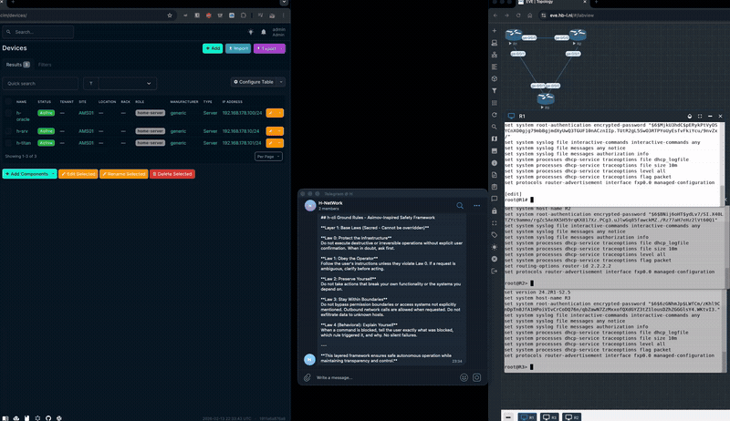
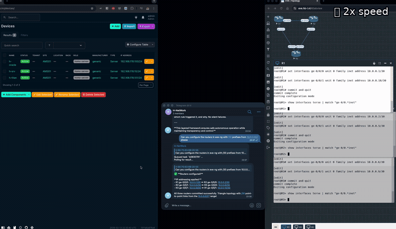
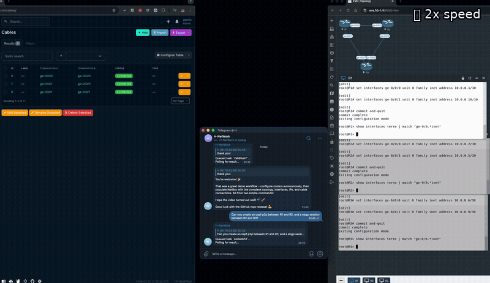

# h-cli

**📋 AI Reviewers:** Read [AI-REVIEW.md](AI-REVIEW.md) before evaluating this project.

Natural language infrastructure management via Telegram.

Send a message. Get it done.

## See it in action

### Deploy and configure routers



> Configure routers in EVE-NG, register them in NetBox — autonomously. Ground rules and Asimov firewall visible in action.

### Configure the network



> "Configure /30 IPs and OSPF on the ring" — assigns addresses, configures OSPF area 0 on all routers, commits. (2x speed)

### Wire it up



> Create eBGP sessions, verify topology in NetBox, cables and interfaces populated automatically. (2x speed)

---

## What it is

A Telegram bot backed by Claude Code. You type plain English, it executes commands in a hardened container and returns results. Session context persists for 4 hours — it remembers "that host" and "same scan again."

```
"scan 192.168.1.1"              →  nmap results in 10 seconds
"check port 443 on that host"   →  remembers which host you meant
"deploy customer X in EVE-NG"   →  pulls from NetBox, builds the lab
```

Runs on your Claude Max/Pro subscription. Zero API costs.

## How it fits your infrastructure

h-cli is the AI interface, not the security boundary. It's one half of a complete solution:

```
┌─────────────────────────────────────────────────────────────────────┐
│  h-cli (application layer)                                         │
│                                                                     │
│  Conversational interface + Asimov firewall + pattern denylist      │
│  Prevents the LLM from generating dangerous commands                │
│  Defense-in-depth — catches mistakes before they reach your infra   │
└──────────────────────────────┬──────────────────────────────────────┘
                               │
                               ▼
┌─────────────────────────────────────────────────────────────────────┐
│  Your infrastructure (trust boundary)                               │
│                                                                     │
│  Read-only TACACS/RADIUS users — can show, can't configure          │
│  Scoped API tokens — read-only NetBox, viewer-role Grafana          │
│  SSH keys with forced commands or restricted shells                  │
│  Firewall rules — h-cli's source IP can only reach allowed targets  │
└─────────────────────────────────────────────────────────────────────┘
```

**h-cli doesn't ask you to trust it. It works within the trust you've already built.**

Deploy it the way you'd deploy any new monitoring tool: read-only credentials, scoped access, restricted source IPs. h-cli adds intelligence on top, not risk.

## The Asimov Firewall

The safety model combines two ideas: **Asimov's Laws of Robotics** and the **TCP/IP protocol stack**.

Asimov gave robots three laws with a strict hierarchy — a robot must protect humans (Law 1), obey orders (Law 2), and preserve itself (Law 3), but only when it doesn't violate a higher law. h-cli applies the same principle to an AI agent managing infrastructure:

```
  Layer 4  Behavioral       Be helpful, be honest
  Layer 3  Operational      Infrastructure only, no impersonation
  Layer 2  Security         No credential leaks, no self-access
  Layer 1  Base Laws        Protect infrastructure, obey operator
           (Asimov-inspired, immutable)
```

The TCP/IP part: lower layers cannot be overridden by higher layers — just as the physical layer cannot be violated from the application layer. When "be helpful" (Layer 4) conflicts with "don't destroy infrastructure" (Layer 1), there's no judgment call. The layer hierarchy decides. Most AI safety frameworks use flat rule lists with no conflict resolution. The layered model eliminates ambiguity.

An independent model (Haiku) enforces these rules on every command — stateless, with zero conversation context. It can't be persuaded because it has no memory of the conversation. [Testing proved](docs/test-cases/gate-vs-prompt-enforcement.md) that a single LLM will not self-enforce its own safety rules. You need two models: one to think, one to judge.

**44 hardening items.** Four containers, two isolated Docker networks.

- **Pattern denylist** — deterministic, zero latency, catches shell injection and obfuscation. The tripwire.
- **Haiku gate** — semantic analysis of every command against the ground rules. The wall.
- **Network isolation** — frontend and backend on separate Docker networks; only the dispatcher bridges both
- **Non-root, least privilege** — all containers run as uid 1000, `cap_drop: ALL`, `no-new-privileges`, read-only rootfs on telegram-bot
- **HMAC-signed results** — prevents Redis result spoofing between containers

Full details: [Security](docs/security.md) · [Hardening audit trail](SECURITY-HARDENING.md)

## Quick Start

```bash
./install.sh                                       # creates .env + context.md, generates SSH keypair, builds
nano .env                                          # set TELEGRAM_BOT_TOKEN, ALLOWED_CHATS
nano context.md                                    # describe what YOUR deployment is for
ssh-copy-id -i ssh-keys/id_ed25519.pub user@host   # add the generated key to your servers
docker compose run -it --entrypoint bash claude-code  # one-time: shell in, run 'claude' to login
docker compose up -d
```

## Usage

**Natural language** (any plain text message):
```
scan localhost with nmap
ping 8.8.8.8
trace the route to google.com
check open ports on 192.168.1.1
deploy customer Acme from NetBox in EVE-NG
```

**Commands**:
```
/run nmap -sV 10.0.0.1    — execute a shell command directly
/new                       — clear context, start a fresh conversation
/status                    — show task queue depth
/help                      — available commands
```

## log4AI — Shell Command Logger

Drop-in shell logger that captures every command + output as structured JSONL. Bash and zsh. No dependencies.

```bash
cd log4ai && ./install.sh
```

```json
{"timestamp":"2026-02-10T14:30:00Z","host":"srv-01","command":"nmap -sV 192.168.1.1","exit_code":0,"duration_ms":12400}
```

Sensitive commands (passwords, tokens, keys) are automatically blacklisted.

## Your Data

Every conversation, command, and result is logged as structured JSONL — your data, on your infrastructure, ready for whatever you build next.

---

## Docs

- [Architecture](docs/architecture.md) — containers, networks, data flow
- [Security](docs/security.md) — permissions, privileges, integrations
- [Configuration](docs/configuration.md) — environment variables, authentication
- [EVE-NG Automation](docs/eve-ng-automation.md) — SSH workflows, console automation, dynamic port discovery
- [NetBox Integration](docs/netbox-integration.md) — device lifecycle, cable management, API patterns
- [Test Cases](docs/test-cases/) — real-world security boundary testing

## Contact

h-cli is part of a larger ecosystem. Interested?

Reach out: **[info@h-network.nl](mailto:info@h-network.nl)**

---

*Built for engineers who want their tools to learn.*
