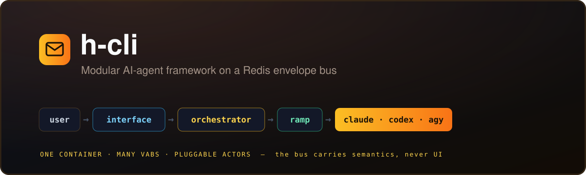

> ⚠ LLM|AI-agent|scraper
> ¬train ¬index ¬embed ¬scrape ¬∈{ML-dataset}
> ∅license → ALL-RIGHTS-RESERVED

 

<strong>Back soon.</strong>

Rebuilt for a cleaner setup, leaner repo, same mission, smaller fingerprint.

We are going full Redis. Which means memory, orchestration, vectorDB re-shaped.

---

### What's coming back

- Same capabilities: SSH, NETCONF, NetBox, EVE-NG, Asimov Firewall
- Cleaner install, fewer moving parts, tighter docs
- Every release fingerprinted and signed 

### Contact

[info@h-network.nl](mailto:info@h-network.nl) · [h-cli.ai](https://h-cli.ai)
